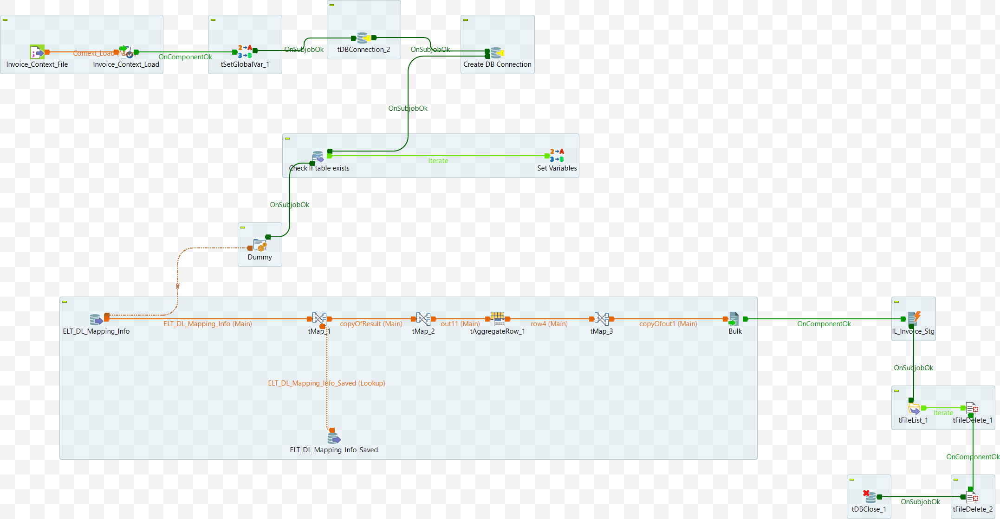

# Data Mart: Alter Delete (ELT_DL_Alter_Delete_Component)

## Intent

Alter Table to delete/drop all the columns for the given `DL_ID` in table `ELT_DL_Alter_Script_Info` of APP DB.

## Input Specifications
The component or service is dependent on the following input data:

- App DB Connection Details
- Target DB Connection Details (TGT_DBNAME ...)
- DL_Name - table name (optional)

## DB Connection 

Once the Input parameters are read into the system, the database connection is established using the provided details — such as URL, username, password, and properties. 

 - Auto commit should be enabled for App DB Connection
 - The database connection must be properly closed at the end of the operation.
 - Additional JDBC Parameters:
    * noDatetimeStringSync=true
    * allowMultiQueries=true


## Component 1: Statement for DROP COLUMN

### Fetch the records from the two Mapping Info tables

- Check if detail of table `DL_Name` exists in the target DB. If it exists, execute alter statement on the table else execute create statement.

  <Details>
    Sample query to check if the table exists in the DB or not!

  ```sql
  SELECT table_name 
  FROM information_schema.tables 
  WHERE table_type <> 'VIEW' 
    AND table_schema = 'TGT_DBNAME' 
    AND (table_name='DL_Name')
  ORDER BY table_name ASC;
  ```
  </Details>

* Fetch the selected fields from the table `ELT_DL_Mapping_Info` as mentioned below. Do the same step for the table `ELT_DL_Mapping_Info_Saved`

    <Details>

      ```sql
      SELECT 
        `ELT_DL_Mapping_Info`.`DL_Id`, 
        `ELT_DL_Mapping_Info`.`DL_Name`, 
        `ELT_DL_Mapping_Info`.`DL_Column_Names`, 
        `ELT_DL_Mapping_Info`.`Constraints`, 
        `ELT_DL_Mapping_Info`.`DL_Data_Types`
      FROM `ELT_DL_Mapping_Info`
      where DL_Id='DL_Id'
      ```
    </Details>
### Map Data

- Find unique columns from lookup tables `ELT_DL_Mapping_Info_Saved` and `ELT_DL_Mapping_Info` using Inner Join
- Form the script to Drop all the columns of the table.

 
<details>
<summary>Additional Details</summary>
    There are four fields in the output. The script field uses the field `DL_Column_Names` value.

    | Name             | Type   | Expression                                                      | isNullable |
    |------------------|--------|-----------------------------------------------------------------|------------|
    | DL_Id            | Long   | ELT_DL_Mapping_Info.DL_Id                                       | true       |
    | DL_Name          | String | ELT_DL_Mapping_Info.DL_Name                                     | true       |
    | DL_Column_Names  | String | ELT_DL_Mapping_Info.DL_Column_Names                             | true       |
    | Script           | String | "Drop Column `ELT_DL_Mapping_Info.DL_Column_Names`     | true       |


Further complete Alter table script shall be formed.

| Name         | Type   | Expression                    | isNullable |
|--------------|--------|-------------------------------|------------|
| DL_Id        | Long   | DL_Id            | true       |
| DL_Name      | String | DL_Name          | true       |
| Alter_Script | String | DL_Alter_Script (See details beow)         | false      |

 
- The Alter script is formed to drop columns. The list of columns can be dropped in a single command or in multiple commands. Different databases support different syntax. Form the script, accordingly.

```sql
ALTER TABLE x DROP COLUMN y, DROP COLUMN z;
OR
ALTER TABLE x DROP COLUMN y;
ALTER TABLE x DROP COLUMN z;
```


Formation of DL_Alter_Script:

| Name             | Expression                                                                      |
|------------------|---------------------------------------------------------------------------------|
| Drop_column      | Result.Script|
| Final_Drop_Column| Final_Drop_Column == null ? Drop_column + "," : Final_Drop_Column + Drop_column + "," |
| Script           | "ALTER TABLE " + DL_Name + " " + Final_Drop_Column                          |
| DL_Alter_Script | StringHandling.LEFT(Script, (StringHandling.LEN(Script) - 1)) + ";"                  |


### Aggregation of the rows

The alter script field of the last record is complete with the information of all columns that need to be dropped. 
Therefore, the rows generated in previous step have to be aggregated on `DL_ID`, `DL_NAME` columns and `Alter_Script` from the last row is selected. SQL clause Order_by alongwith LIMIT may be used.

</details>

### Addtional fields
Addtional fields are updated with appropriate values - Active_Flag (true),  Added_Date, Added_User, Updated_Date, Updated_User

## Store the Generated Data

The destination for the generated data is the table `ELT_DL_Alter_Script_Info` of Target DB.


## Appendix A

Schematic diagram of the component (Talend job).


