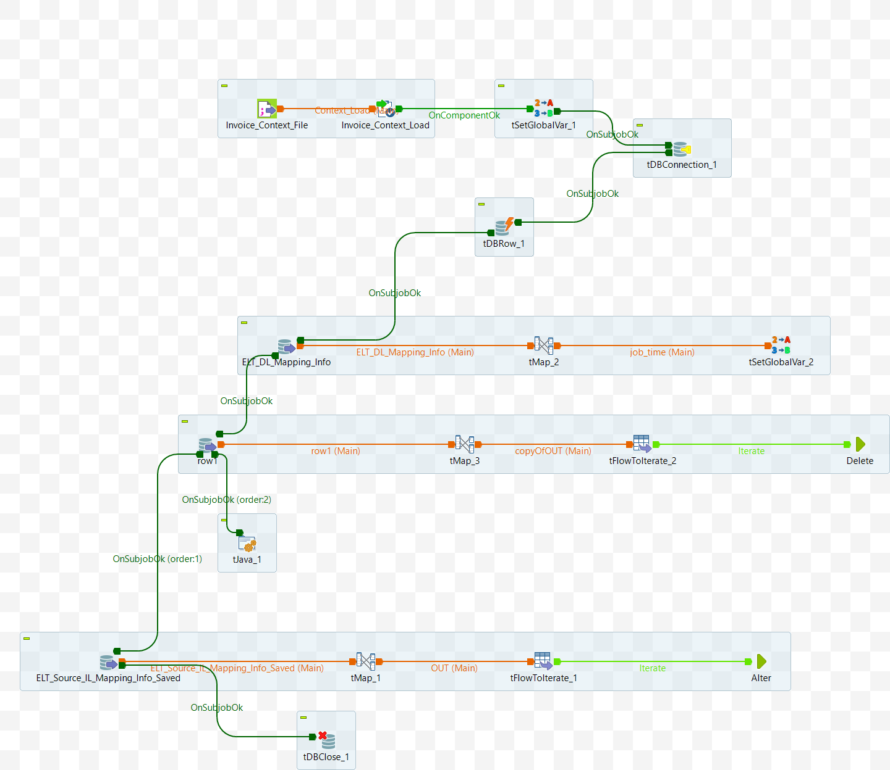

# Data Mart: Alter Job Group (ELT_DL_Alter_Job_M8_v3)

## Intent

This is a parent job/service for Alter operations. It calls the Alter_Job and Alter_Delete jobs/services.

The major tasks of the job/service are listed here.

## Input Specifications
The component or service is dependent on the following input data:

- App DB Connection Details
- DL_Id - table Id

## DB Connection 

Once the Input parameters are read into the system, the database connection is established using the provided details — such as URL, username, password, and properties. 

 - Auto commit should be enabled for App DB Connection
 - The database connection must be properly closed at the end of the operation.
 - Additional JDBC Parameters:
    * noDatetimeStringSync=true

## Component 1: set `Active_flag` to 0

- Update the row in the table `ELT_DL_Alter_Script_Info` by setting the `Active_flag` to 0 for the given `DL_Id`
- Reference Points - TBD

 <details>
  <summary>Additional Details</summary>

  ```sql
    Update  ELT_DL_Alter_Script_Info set Active_flag=0  where DL_Id=`DL_Id`
  ```
 </details>

## Component 2: Execute Alter Delete job/service

- find out recent update date from the table `ELT_DL_Mapping_Info`. Refer it as `Max_Update_date`.

- Find if details of the Input `DL_Id` exists or not.  Find unique list of table Ids ( `DL_Ids`) from `ELT_DL_Mapping_Info_Saved`. There shall be only one record.
    - if `DL_Id` does not exist, DO ... (TBD)
- Call service/job [Alter Delete Service/Job](ELT_DL_Alter_Delete_Job_M8_v1.md)

  <details>
  <summary>Additional details</summary>

  ```sql
  select max(Updated_Date) from ELT_DL_Mapping_Info where DL_Id='"+context.DL_Id+"'"
  ```

  ```sql
  SELECT distinct 
    `ELT_DL_Mapping_Info_Saved`.`DL_Id`
  FROM `ELT_DL_Mapping_Info_Saved` 
  where DL_Id ='DL_Id'
  ```
  </Details>

## Component 3: Execute Alter job/service

- Find if details of the Input `DL_Id` exists or not.  Find unique list of table Ids ( `DL_Ids`) from `ELT_DL_Mapping_Info_Saved` where update date is greater than `Max_Update_date`. There shall be only one record.
    -  if `DL_Id` does not exist, DO ... (TBD)

- Call service/job [Alter Service/Job](./ELT_DL_Alter_Job_M8_v3.md)

    <details>
    <summary>Additional details</summary>

      ```sql
      SELECT distinct 
        `ELT_DL_Mapping_Info_Saved`.`DL_Id`
      FROM `ELT_DL_Mapping_Info_Saved` 
      where DL_Id ='DL_Id' and Updated_Date>'Max_Update_date'
      ```
    </Details>

## Appendix A

Schematic diagram of the component (Talend job).


