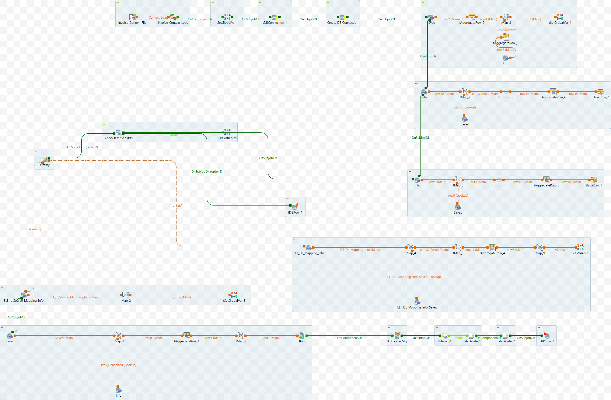

# Data Mart: Alter Job (ELT_DL_Alter_Job_M8_v3)

## Intent

The Objective of this service/job is to create an ALTER script for the table that will Change or delete columns and add columns with updated constraints. NULL or NOT NULL.

The major tasks of the job/service are listed here.
## Input Specifications
The component or service is dependent on the following input data:

- App DB Connection Details
- Target DB Connection Details (TGT_DBNAME ...)
- DL_Name - table name (optional)

## DB Connection 

Once the Input parameters are read into the system, the database connection is established using the provided details — such as URL, username, password, and properties. 

 - Auto commit should be enabled for App DB Connection
 - The database connection must be properly closed at the end of the operation.
 - Additional JDBC Parameters:
    * noDatetimeStringSync=true
    * allowMultiQueries=true


## Component 1: Statement for `Primary Key` PK Columns

- From both the tables, primary key records are fetcched.
- The values in the DL_Column_Names field must be enclosed in backticks (``) as required by MySQL for correct column name referencing. This modified value is stored in the derived column tilt_columns.
- Aggregate on the column `DL_ID`. 
- output column is DL_Column_Names. make a list of data of this field.

 <details>
<summary>Additional Details</summary>

```sql
SELECT 
  `ELT_DL_Mapping_Info`.`DL_Id`, 
  `ELT_DL_Mapping_Info`.`DL_Column_Names`
FROM `ELT_DL_Mapping_Info` where DL_Id='"+ DL_Id+"' and Constraints='PK' order by DL_Column_Names
```

- Aggregate on the column `DL_ID`. 
- output columns are DL_Column_Names, tilt_columns. Make a list of data in thse fields. 

```sql
SELECT 
  `ELT_DL_Mapping_Info_Saved`.`DL_Id`, 
  `ELT_DL_Mapping_Info_Saved`.`DL_Column_Names`,
  concat('`',`ELT_DL_Mapping_Info_Saved`.`DL_Column_Names`,'`') as tilt_columns
FROM `ELT_DL_Mapping_Info_Saved` where DL_Id='"+context.DL_Id+"' and Constraints='PK' order by DL_Column_Names
```

### Map data 1

- The output fields are "Change_Flag" and "PKColumns". These fields are used later.

| Name         | Type   | Expression                                   | isNullable |
|--------------|--------|----------------------------------------------|------------|
| PKColumns    | String | ELT_DL_Mapping_Info_Saved.tilt_column_names                       | false      |
| Change_Flag  | String | ELT_DL_Mapping_Info.DL_Column_Names == null ? "Y" : "N"     | false      |

 </details>


## Component 2: Statement for `CHANGE COLUMN` with `NOT NULL`)

- Relevant data is extracted from `ELT_DL_Mapping_Info_Saved` (Set A) and `ELT_DL_Mapping_Info` (Set B).
    - select fields (DL_Id, DL_Column_Names, tilt_columns, DL_Data_Types, Constraints)
    - Retrieve rows related to primary keys in Set A.
    - make NULL constraint as Empty string (likely required in only Set B)
    - The values in the DL_Column_Names field must be enclosed in backticks (``) as required by MySQL for correct column name referencing. This modified value is stored in the derived column `tilt_columns`.
- Map the data as described below. Aggregate the data on `DL_ID`. Choose the last row as it has comprehensive details of DL_Column_Names.
- The above `statement` is used in a later step. [NOT_NULL_FINAL_STATEMENT]
 <details>
<summary>Additional Details</summary>

### Data extracted from `ELT_DL_Mapping_Info_Saved`. 
```sql
SELECT 
  `ELT_DL_Mapping_Info_Saved`.`DL_Id`, 
  `ELT_DL_Mapping_Info_Saved`.`DL_Column_Names`,
  concat('`',`ELT_DL_Mapping_Info_Saved`.`DL_Column_Names`,'`') as tilt_columns,
  DL_Data_Types,
  case when Constraints is null then '' else Constraints end as Constraints
  FROM `ELT_DL_Mapping_Info_Saved` where DL_Id='"+DL_Id+"' and DL_Name='"+DL_Name+"' and Constraints='PK' order by DL_Column_Names
```
### Data extracted from `ELT_DL_Mapping_Info`
```sql
SELECT 
  `ELT_DL_Mapping_Info`.`DL_Id`, 
  `ELT_DL_Mapping_Info`.`DL_Column_Names`,
  concat('`',`ELT_DL_Mapping_Info`.`DL_Column_Names`,'`') as tilt_columns,
  DL_Data_Types,
  case when Constraints is null then '' else Constraints end as Constraints
  FROM `ELT_DL_Mapping_Info` where DL_Id='"+DL_Id+"' and DL_Name='"+DL_Name+"' order by DL_Column_Names
```
 ### Map 1

 - from the above two data sets A & B, `Change Column` Sql statement is formed.  Value is saved in `final_statement`.
    - Append `NOT NULL` to the DL_Column_Names values from set A if the corresponding constraint in set B is an empty string ("").
 - Values in Subsequent rows contains values of all the previous rows. 


Reference expressions. The SetA refers to first set of data. The SetB refers to second set of data.
```sql
  SetB.DL_Data_Types ==null ?null:
  (((StringHandling.DOWNCASE(SetA.Constraints ).contains("pk"))&&SetB.Constraints.equals("")) ? 

  "Change column "+SetA.tilt_columns+ " "+SetA.tilt_columns+" "+SetA.DL_Data_Types+" not NULL ":null ) 


  Var.final_statement==null? Var.condition :
  (Var.condition==null? Var.final_statement : Var.final_statement+","+Var.condition ) 
```
</details>


## Component 3: Statement for `CHANGE COLUMN` with `NULL`

It is very similar to Component 2, with the roles of the two tables reversed. Additionally, the `CHANGE COLUMN` clause is used in conjunction with `NULL`.

- Relevant data is extracted from `ELT_DL_Mapping_Info` (Set A) and `ELT_DL_Mapping_Info_Saved` (Set B).
    - select fields (DL_Id, DL_Column_Names, tilt_columns, DL_Data_Types, Constraints)
    - Retrieve rows related to primary keys in Set A.
    - make NULL constraint as Empty string (likely required in only Set B)
    - The values in the DL_Column_Names field must be enclosed in backticks (``) as required by MySQL for correct column name referencing. This modified value is stored in the derived column `tilt_columns`.
-  Map the data as described below. Aggregate the data on `DL_ID`. Choose the last row as it has comprehensive details of DL_Column_Names.
- The above `statement` is used in a later step. [NULL_FINAL_STATEMENT]

<details>
<summary>Additional Details</summary>

  ### Data extracted from `ELT_DL_Mapping_Info` (Set A)
  ```sql
  SELECT 
    `ELT_DL_Mapping_Info`.`DL_Id`, 
    `ELT_DL_Mapping_Info`.`DL_Column_Names`,
    concat('`',`ELT_DL_Mapping_Info`.`DL_Column_Names`,'`') as tilt_columns,
    DL_Data_Types,
    case when Constraints is null then '' else Constraints end as Constraints
    FROM `ELT_DL_Mapping_Info` where DL_Id='"+context.DL_Id+"' and DL_Name='"+context.DL_Name+"' and Constraints='PK' order by DL_Column_Names
  ```

  ### Data extracted from `ELT_DL_Mapping_Info_Saved` (Set B)
  ```sql
  SELECT 
    `ELT_DL_Mapping_Info_Saved`.`DL_Id`, 
    `ELT_DL_Mapping_Info_Saved`.`DL_Column_Names`,
    concat('`',`ELT_DL_Mapping_Info_Saved`.`DL_Column_Names`,'`') as tilt_columns,
    DL_Data_Types,
    case when Constraints is null then '' else Constraints end as Constraints
    FROM `ELT_DL_Mapping_Info_Saved` where DL_Id='"+context.DL_Id+"' and DL_Name='"+context.DL_Name+"' order by DL_Column_Names
  ```

  ### Map 1

  - from the above two data sets A & B, `Change Column` Sql statement is formed. Value is saved in `final_statement`.
      - Append ` NULL` to the DL_Column_Names values from set A if the corresponding constraint in set B is an empty string ("").
  - Values in Subsequent rows contains values of all the previous rows. 


  Reference expressions. The SetA refers to first set of data. The SetB refers to second set of data.
  ```sql
    SetB.DL_Data_Types ==null ?null:
    (((StringHandling.DOWNCASE(SetA.Constraints ).contains("pk"))&&SetB.Constraints.equals("")) ? 

    "Change column "+SetA.tilt_columns+ " "+SetA.tilt_columns+" "+SetA.DL_Data_Types+" NULL ":null ) 
  ```
</details>

## Component 4: Update `ELT_DL_Alter_Script_Info` with Active_flag=0

  - Update the row in the table `ELT_DL_Alter_Script_Info` by setting the `Active_flag` to 0 for the given `DL_Id`

 <details>
    <summary>Additional Details</summary>

    ```sql
    "Update  ELT_DL_Alter_Script_Info set Active_flag=0  where DL_Id='"+context.DL_Id+"'"
    ```
 </details>

## Component 5: Check the existance of the table correspeonding to `DL_Name`

- Check if table `DL_Name` exists in the target DB. If it exists, execute alter statement on the table else execute create statement.
- If Table exists, execute ALTER statement. Else if, Table doesn't exist, Proceed with CREATE statement (Functionality missing)


## Component 6: Statement for `DELETE/DROP COLUMN`

- Executed if Alter is set true.
- Relevant data is extracted from ELT_DL_Mapping_Info (Set A) and ELT_DL_Mapping_Info_Saved (Set B)
    - Find unique columns from the table `ELT_DL_Mapping_Info_Saved` and `ELT_DL_Mapping_Info` (lookup) using Inner Join.
    - columns include `DL_Id`, `DL_Name`, `DL_Column_Names`, `Constraints` and `DL_Data_Types`
- Map the data appropriately for output fields - `DL_Id`, `DL_Name`, `DL_Column_Names`, `script`
    - `script` field shall be set like below
      ```code
      Drop Column `ELT_DL_Mapping_Info.DL_Column_Names`
      ```
- Synthesise complete Alert Script
    ```code
    Alter Table `DL_Name` script
    ```
- Group the data on `DL_ID`, `DL_Name`. Aggregate Choose the last row as it has comprehensive details of Alert script.
- Delete ALter Script shall be referred later.


## Component 7: Find last Job update time
  - find the recent updated date for the given tablename. 
    - Select latest `updated_date` of `ELT_DL_Mapping_Info` for given `DL_Name`.
  
## Component 8: Complete Alert Script statement

Form a consolidated Alter script incorporating all the intermediate partial statements formed in previous components.
 
  - Relevant data is extracted from ELT_DL_Mapping_Info_Saved (Set A) and ELT_DL_Mapping_Info (Set B)
    - Find unique columns from the table `ELT_DL_Mapping_Info_Saved` and `ELT_DL_Mapping_Info` (lookup) using Inner Join.
  - An Alter script is formed where Old columns are dropped and new columns are added with updated constraint list.
    - `NOT_NULL_FINAL` Statement from [Component 2](#component-2-statement-for-change-column-with-not-null) is referred to here.
    - NULL_FINAL_STATEMENT from [Component 3](#component-3-statement-for-change-column-with-null) is referred to here.
    - `Change_Flag` and `PKColumns` from [Component 1](#component-1-statement-for-primary-key-pk-columns) is referred to here.
    - DELETE_ALTER_SCRIPT from the job [Component 6](#component-6-statement-for-deletedrop-column) is referred to here.
    -  Group the data on `DL_ID`, `DL_Name`. Choose the last row as it has comprehensive details of Alert script.
  - Additionaly, Added/Updated Date/User fields are updated with current values.


### Addtional fields
Addtional fields are updated with appropriate values - Active_Flag (true),  Added_Date, Added_User, Updated_Date, Updated_User

<details>
<summary> Additional Details </summary>

Below table list all the intermediate expressions or references used to find the alert script.
| Name                | Expression                                                                                                                                                                                                                                                                                                                                                                                                            |
|---------------------|------------------------------------------------------------------------------------------------------------------------------------------------------------------------------------------------------------------------------------------------------------------------------------------------------------------------------------------------------------------------------------------------------------------------|
| notnull_query       | (String)(globalMap.get("notnull_final_statement"))                                                                                                                                                                                                                                                                                                                                                                     |
| notnull_check       | (Var.notnull_query == null \|\| Var.notnull_query.isEmpty() \|\| Var.notnull_query.equals(null) \|\| Var.notnull_query.equals("NULL")) ? "" : Var.notnull_query + ","                                                                                                                                                                                                                                                |
| null_query          | (String)(globalMap.get("final_statement"))                                                                                                                                                                                                                                                                                                                                                                             |
| notnull_flag        | (Var.null_query == null \|\| Var.null_query.isEmpty() \|\| Var.null_query.equals(null) \|\| Var.null_query.equals("NULL")) ? Var.notnull_check : Var.notnull_check + (String)(globalMap.get("final_statement")) + ","                                                                                                                                                                                                |
| DL_Data_Types       | StringHandling.DOWNCASE(Saved.DL_Data_Types).contains("bit") ? "tinyint(1)" : Saved.DL_Data_Types                                                                                                                                                                                                                                                                                                                      |
| Adding_Column       | Prev_Genearted.DL_Column_Names == null ? "ADD COLUMN `" + Saved.DL_Column_Names + "` " + Var.DL_Data_Types : (Prev_Genearted.DL_Column_Names == null ? "" : ((!Saved.DL_Column_Names.equals(Prev_Genearted.DL_Column_Names) \|\| !Saved.DL_Data_Types.equals(Prev_Genearted.DL_Data_Types)) && (Saved.Constraints.equals("PK")) ? "CHANGE `" + Prev_Genearted.DL_Column_Names + "` `" + Saved.DL_Column_Names + "` " + Var.DL_Data_Types + " NOT NULL " : (!Saved.DL_Column_Names.equals(Prev_Genearted.DL_Column_Names) \|\| !Saved.DL_Data_Types.equals(Prev_Genearted.DL_Data_Types)) ? "CHANGE `" + Prev_Genearted.DL_Column_Names + "` `" + Saved.DL_Column_Names + "` " + Var.DL_Data_Types : "")) |
| Final_Adding_Column | Var.Adding_Column == null \|\| Var.Adding_Column.equals("") \|\| Var.Adding_Column.isEmpty() ? Var.Final_Adding_Column : (Var.Final_Adding_Column == null ? Var.Adding_Column : Var.Final_Adding_Column + "," + Var.Adding_Column)                                                                                                                                                                                                                           |
| Drop_Columns        | ((String)globalMap.get("Delete_Alter_Script")) == null \|\| ((String)globalMap.get("Delete_Alter_Script")).equals("") \|\| ((String)globalMap.get("Delete_Alter_Script")).isEmpty() ? "" : ((String)globalMap.get("Delete_Alter_Script"))                                                                                                                                                                               |
| Drop_Flag           | (Var.Drop_Columns == null \|\| Var.Drop_Columns.equals("") \|\| Var.Drop_Columns.isEmpty()) ? "N" : "Y"                                                                                                                                                                                                                                                                                                                |
| Scripts             | ((Var.Final_Adding_Column == null \|\| Var.Final_Adding_Column.equals("") \|\| Var.Final_Adding_Column == "" \|\| Var.Final_Adding_Column.isEmpty()) && (Var.Drop_Flag.equals("N"))) ? "" : ((Var.Final_Adding_Column == null \|\| Var.Final_Adding_Column.equals("") \|\| Var.Final_Adding_Column == "" \|\| Var.Final_Adding_Column.isEmpty()) && (Var.Drop_Flag.equals("Y"))) ? "ALTER TABLE `" + Saved.DL_Name + "` " + Var.Drop_Columns : Var.Drop_Flag.equals("N") ? "ALTER TABLE `" + Saved.DL_Name + "` \n " + Var.notnull_flag + " " + Var.Final_Adding_Column : "ALTER TABLE `" + Saved.DL_Name + "` \n " + Var.notnull_flag + " " + Var.Drop_Columns + ", " + Var.Final_Adding_Column |
| DL_Script           | (Var.Scripts == null \|\| Var.Scripts.equals("") \|\| Var.Scripts == "") && (((String)globalMap.get("Change_Flag")).equals("N")) ? "" : (Var.Scripts == null \|\| Var.Scripts.equals("") \|\| Var.Scripts == "") && (((String)globalMap.get("Change_Flag")).equals("Y")) ? "Alter table `" + Saved.DL_Name + "`\n " + Var.notnull_flag + "\n DROP PRIMARY KEY, \n ADD PRIMARY KEY (" + ((String)globalMap.get("PKColumns")) + ");" : ((Var.Scripts != null \|\| !Var.Scripts.equals("") \|\| Var.Scripts != "") && (((String)globalMap.get("Change_Flag")).equals("Y")) ? StringHandling.LEFT(Var.Scripts, (StringHandling.LEN(Var.Scripts))) + ",\n DROP PRIMARY KEY, \n ADD PRIMARY KEY (" + ((String)globalMap.get("PKColumns")) + ");" : StringHandling.LEFT(Var.Scripts, (StringHandling.LEN(Var.Scripts))) + ";") |
| script            | Var.DL_Script == null \|\| Var.DL_Script.equals("NULL") \|\| Var.DL_Script.isEmpty() \|\| Var.DL_Script.equals("") ? "N" : Var.DL_Script                                                                                                                                                                                                                                                                              |
</details>

## Component 9: Store the Generated Data

- The generated data is stored into table `ELT_DL_Alter_Script_Info` of App DB.
- Close the DBs.

#####################################################

## Appendix A

Schematic diagram of the component (Talend job).


