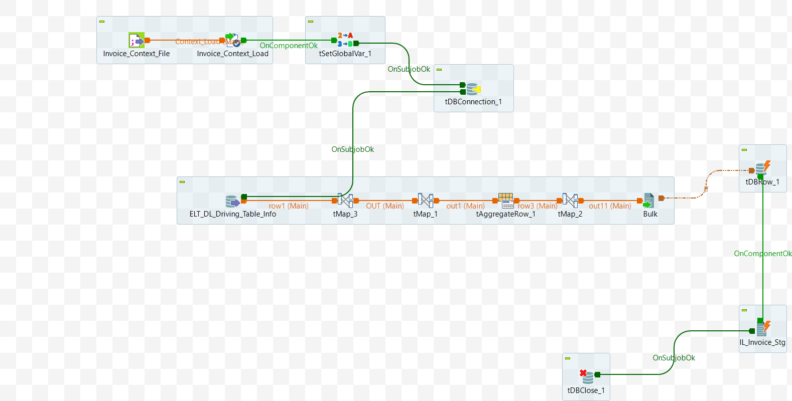

# Data Mart: Structure Script Generate	 (ELT_DL_DataMart_Create_Script_M8_v1)

# Intent

The purpose of this component is to generate a script for creating a table based on a given Table ID (input). All necessary details, such as table name, columns, data types, and constraints (primary and secondary), are retrieved from the `ELT_DL_Mapping_Info_Saved` table. The generated script is then stored in the `ELT_DL_Create_Info` table, keyed by the respective table name. A schematic diagram is provided in [Appendix A](#appendix-a)

For the component to function independently, whether as part of a Talend job or as a service, all required parameters should be passed as input parameters. Context variables should be used in a Talend job, while a request object should be employed in a service.

The component's main tasks can be broken down into the following sub-components:

## Input Specifications
The component or service is dependent of the following input data:

The component or service is dependent on the following input data:

- App DB Connection Details
- DL_Id - table id for which create script to be generated

## DB Connection 

Once the Input parameters are read into the system, the database connection is established using the provided details — such as URL, username, password, and properties.
 - Auto commit should be enabled for App DB Connection
 - The database connection must be properly closed at the end of the operation.
 - Additional JDBC Parameters:
    * noDatetimeStringSync=true


<details>
<summary>Addtional info</summary>
Below are the details to setup a mysql connection.

```java
properties_string = "noDatetimeStringSync=true"
dbUrl = "jdbc:mysql://" + context.APP_HOST + ":" + context.APP_PORT + "/" + context.APP_DBNAME + "?" + properties_string;
...

```
username and password need to passed to create connection.
</details>

# Component 1: Read Data from ELT_DL_Mapping_Info_Saved
Following  columns from the table **ELT_DL_Mapping_Info_Saved** are fetched for the input param **DL_Id**:

It is similar but refined version of the query in the another create script.
- Columns: `DL_Id`, `DL_Name`, `DL_Column_Names`, `Constraints`, `DL_Data_Types`
- All the data in columns of type String and Char must be trimmed. 
- Wherever applicable, bit(1) data type should be changed to tinyint(1). MySql?
- Later dataType 'text' is converted into varchar(150) while creating definition
<details>
<summary>details</summary>
Query to fetch data:

Quite similar to that in another script. Little more refined.
``` sql
SELECT 
  DISTINCT 
  DL_Name AS Table_Name,
  DL_Column_Names AS Column_Name_Alias,
  `Constraints`,
  CASE 
    WHEN DL_Data_Types = 'bit(1)' THEN 'tinyint(1)' 
    ELSE DL_Data_Types 
  END AS DL_Data_Types,
  DL_Id 
FROM 
  ELT_DL_Mapping_Info_Saved
WHERE 
  DL_Id = 'DL_Id';
```

</details>

## Map Data 1

In the previous step, five fields from each row are read and mapped to the corresponding target fields as described below.


| Name	| Type	| isNullable	| Details|
| --- | ---| ---| ---|
| create	| String	| TRUE	| 	|
| Table_Name | String | TRUE	| 	|
| Column_Names | String | TRUE	| See details	|
| PKs | String | TRUE	| See details	|
| SK | String | TRUE	| See details	|
| DL_Id | Long | TRUE	| 	|

1. create
    ```
    this.Table_Name = row.DL_Name 
    create = "CREATE TABLE IF NOT EXISTS "+ this.Table_Name+" ("
    ```
2. Table_Name
    ```
    this.Table_Name = row.DL_Name 
    ```

4. PKs (see details)

    The Field must have all previous PKs prepended. 
    Note: Columns names may be tickquoted for mysql
    ```java
    If Constraint is 'PK',  
        PKs = row.Column_Names + ","
    else
        PKs = null //default value
    ```

5. SK (see details)

    The Field must have all previous SK prepended. 

    ```java
    If Constraint is 'SK',
        SK = row.Column_Names + ","
    else
        SK = null //default value
    ```

5. Column_Names (see details)

    Note: Here it differs from another create script.  if `dataType` is text change it to `varchar`

    ```python
    Column_Names = "\n" + row.DL_Column_Names+" "+row.DL_Data_Types + " " 

    Note: In addition to another create script
    [If datatype is text && constraint is 'pk'] - DL_Data_Types = "varchar(150)"

    [If datatype is varchar] -  + "COLLATE utf8_unicode_ci"
        else                    + " "
    [If constraint is 'pk']  -  + "NOT NULL DEFAULT "  + DEFAULT_VALUE_FOR_TYPE
        else                 - +  " DEFAULT NULL"

    Default values could be one of these based on the datatype
    varchar -'',
    int - 0,
    decimal -  0.0,
    float -  0.0,
    boolean - 0,
    date - '0000-00-00'
    OTHER - " "

    Additonally, 
    text - '',
    char - ''
    ```


6. DL_Id
    ```
    DL_Id = row.DL_Id
    ```


    <details>

    Below are the expressions configured in talend for the above properties.

    | Name         | Expression|
    |--------------|-------|
    | Table_Name   | context.DL_Name  |
    | create       | "CREATE TABLE IF NOT EXISTS `"+Var.Table_Name+"` ("  |
    | PKs          | StringHandling.DOWNCASE(OUT.Constraints).equals("pk") ? (Var.PKs == null ? "" : Var.PKs)+"`"+OUT.Column_Name_Alias +"`,": Var.PKs |
    | SKs          | StringHandling.DOWNCASE(OUT.Constraints).equals("sk") ? (Var.SKs == null ? "" : Var.SKs)+"`"+OUT.Column_Name_Alias +"`,": Var.SKs |
    | SKs1         | Var.SKs==null?"":Var.SKs  |
    | Column_Names | "\n"+"`"+OUT.Column_Name_Alias+"` "+ (OUT.Data_Type.startsWith("text") && StringHandling.DOWNCASE(OUT.Constraints).equals("pk") ? "varchar(150)" : OUT.Data_Type ) +" " + (StringHandling.DOWNCASE(OUT.Data_Type).startsWith("varchar")? "COLLATE utf8_unicode_ci":" ") +" "+ (StringHandling.DOWNCASE(OUT.Constraints).equals("pk") ? (" NOT NULL DEFAULT "+(StringHandling.DOWNCASE(OUT.Data_Type).contains("varchar")?"''": (StringHandling.DOWNCASE(OUT.Data_Type).contains("int")?"'0'": (StringHandling.DOWNCASE(OUT.Data_Type).contains("text")?"''": (StringHandling.DOWNCASE(OUT.Data_Type).contains("decimal")?"'0.0'": (StringHandling.DOWNCASE(OUT.Data_Type).contains("float")?"'0.0'": (StringHandling.DOWNCASE(OUT.Data_Type).contains("Boolean")?"0": (StringHandling.DOWNCASE(OUT.Data_Type).contains("char")?"''": (StringHandling.DOWNCASE(OUT.Data_Type).contains("date")?"'0000-00-00'":" "))))))))) :(StringHandling.DOWNCASE(OUT.Constraints).equals("sk")? " NOT NULL DEFAULT '0' " : " DEFAULT NULL")) |


    </details>

## Aggregate

Group by all the records based on the fields `Table_Name` and `DL_Id`


 - Concatenate all the `Column_Names`. GROUP_CONCAT() may be used

 - Choose last value from the grouped rows for `PKs`, `create`, `SK`. Order_by alongwith LIMIT may be used.


## Map Data 2

There are three fields in the output. The script field is generated by combining multiple input fields.

| Name      | Type   | Expression      | isNullable |
|-----------|--------|-----------------|------------|
| DL_Id     | Long   | row.DL_Id       | true       |
| DL_Name   | String | row.Table_Name  | true       |
| Script    | String | See details below       | true       |

Script

The expression is constructed to encompass all the necessary information for creating a table. See details below.

```
the expression is formed to comprise all the information to create a table. Refer Details.

create table clause + columns names + Primary key + Secondary key + additional parameters

ENGINE=InnoDB 
DEFAULT CHARSET=utf8 
COLLATE=utf8_unicode_ci

```


<details>

Below are the expressions configured in talend for the above properties.

| Name    | Expression                                                                                   |
|---------|----------------------------------------------------------------------------------------------|
| length  | StringHandling.LEN(row3.PKs) - 1                                                             |
| PKs     | row3.PKs.substring(0, Var.length)                                                            |
| PKs1    | row3.PKs + row3.SK                                                                           |
| SKs     | StringHandling.LEN(Var.PKs1) - 1                                                             |
| SKs1    | Var.PKs1.substring(0, Var.SKs)                                                               |
| PK      | " Primary Key (" + Var.SKs1 + " ) "                                                          |
| end     | ") ENGINE=InnoDB DEFAULT CHARSET=utf8 COLLATE=utf8_unicode_ci"                               |
| script  | row3.create + row3.Column_Names + ",\n" + Var.PK + "\n" + Var.end                            |

</details>


## Store the Generated Data

The destination for the generated data is the table `ELT_DL_Create_Info`. Before storing the data, any existing data corresponding to the given `DL_Name` must be purged. (see details below)

### Talend

- Temporarily store the data in a CSV file at a pre-specified location.
- The data can then be bulk loaded into the database.

### Java

- Temporarily hold the data in memory.
- Insert the data into the table in batches. For large datasets, ensure this step is performed seamlessly.
 

<details>
Purge the data corresponding to given DL_Name from the table 

```sql
"Delete from ELT_DL_Create_Info  where  DL_Name = '" + context.DL_Name +"' "
```

Loading the data into the Table:

talend:

```sql
LOAD DATA LOCAL INFILE <filename> INTO TABLE "ELT_DL_Create_Info" ...
```

Java:

```sql
 // Use batch commands (e.g. addBatch, executeBatch)
```
</details>


## Output Specifications


The table `ELT_DL_Create_Info` should be updated with a new row for the input `DL_ID` comprising `DL_ID`, `DL_NAME` and generated script (`script`)

## Appendix A

Schematic diagram of the component.




## Appendix B

List of all Context Variables.
