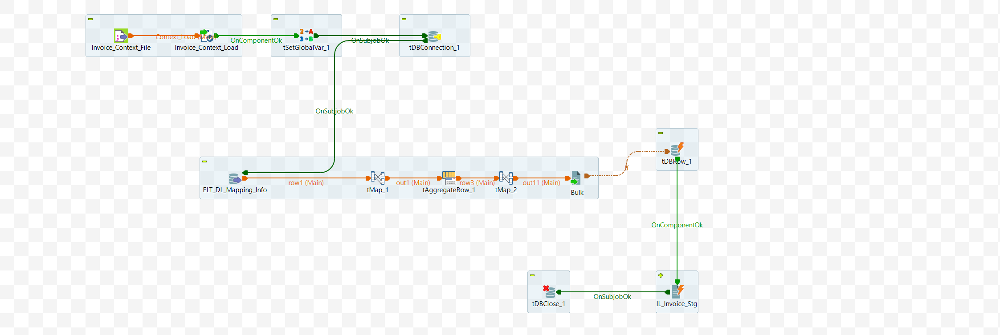

# Data Mart Create Script (ELT_DL_DataMart_Create_Script_M8_v1)

The purpose of this component is to generate a script for creating a table based on a given Table ID (input). All necessary details, such as table name, columns, data types, and constraints (primary and secondary), are retrieved from the ELT_DL_Mapping_Info_Saved table. The generated script is then stored in the LT_DL_Create_Info table, keyed by the respective table name. A schematic diagram is provided in [Appendix A](#appendix-a)

For the component to function independently, whether as part of a Talend job or as a service, all required parameters should be passed as input parameters. Context variables should be used in a Talend job, while a request object should be employed in a service.

The component's main tasks can be broken down into the following sub-components:

## Input Specifications
The component or service is dependent of the following input data:
### Talend

- Context Variables (APP DB Connection, DL_ID), For Complete List of Context Variable, refer to [Appendix B](#appendix-b)
- The data can then be bulk loaded into the database.

### Java

- App DB coonection details, DL_ID - table id for which create script to be generated

## DB Connection 

Once the Input parameters are read into the system, Database Connection is established. All the necessary information to create connection, namely, url, username, password, properties etc. are available as input parameters. 

Auto commit should be set.

At the end of operation, the above database connection should be properly closed.

<details>
<summary>Addtional info</summary>
Below are the details to setup a mysql connection

```java
properties_string = "noDatetimeStringSync=true"
dbUrl = "jdbc:mysql://" + context.APP_HOST + ":" + context.APP_PORT + "/" + context.APP_DBNAME + "?" + properties_string;
...

```
username and password need to passed to create connection.
</details>

## Read Data from ELT_DL_Mapping_Info_Saved
Following  columns from the table **ELT_DL_Mapping_Info_Saved** are fetched for the input param **DL_Id**:

`DL_Id`, `DL_Name`, `DL_Column_Names`, `Constraints`, `DL_Data_Types`
All the data in columns of type String and Char must be trimmed
<details>
<summary>details</summary>
Query

``` sql
SELECT 
    `ELT_DL_Mapping_Info_Saved`.`DL_Id`, 
    `ELT_DL_Mapping_Info_Saved`.`DL_Name`, 
    `ELT_DL_Mapping_Info_Saved`.`DL_Column_Names`, 
    `ELT_DL_Mapping_Info_Saved`.`Constraints`, 
    `ELT_DL_Mapping_Info_Saved`.`DL_Data_Types` 
FROM 
    `ELT_DL_Mapping_Info_Saved` 
WHERE 
    `DL_Id` = '" + DL_Id + "'
```

</details>

## Map Data 1

In the previous step, five fields from each row are read and mapped to the corresponding target fields as described below.


| Name	| Type	| isNullable	| Details|
| --- | ---| ---| ---|
| create	| String	| TRUE	| 	|
| Table_Name | String | TRUE	| 	|
| Column_Names | String | TRUE	| See details	|
| PKs | String | TRUE	| See details	|
| SK | String | TRUE	| See details	|
| DL_Id | Long | TRUE	| 	|

1. create
    ```
    this.Table_Name = row.DL_Name 
    create = "CREATE TABLE IF NOT EXISTS "+ this.Table_Name+" ("
    ```
2. Table_Name
    ```
    this.Table_Name = row.DL_Name 
    ```

4. PKs (see details)
    ```java
    If Constraint is 'PK',  
        PKs = row.Column_Names + ","
    else
        PKs = null //default value
    ```

5. SK (see details)
    ```java
    If Constraint is 'SK',
        SK = row.Column_Names + ","
    else
        SK = null //default value
    ```

5. Column_Names (see details)
    ```python
    Column_Names = "\n" + row.DL_Column_Names+" "+row.DL_Data_Types + " " 
    [If datatype is varchar] -  + "COLLATE utf8_unicode_ci"
        else                    + " "
    [If constraint is 'pk']  -  + "NOT NULL DEFAULT "  + DEFAULT_VALUE_FOR_TYPE
        else                 - +  " DEFAULT NULL"

    Default values could be one of these based on the datatype
    varchar -'',
    int - 0,
    decimal -  0.0,
    float -  0.0,
    boolean - 0,
    date - '0000-00-00'
    OTHER - " "
    ```


6. DL_Id
    ```
    DL_Id = row.DL_Id
    ```


    <details>

    Below are the expressions configured in talend for the above properties.

    | Name         | Expression                                                                                                                                                                                                                                                                                                                                                                                                                                                                                      |
    |--------------|-------------------------------------------------------------------------------------------------------------------------------------------------------------------------------------------------------------------------------------------------------------------------------------------------------------------------------------------------------------------------------------------------------------------------------------------------------------------------------------------------|
    | Table_Name   | row1.DL_Name                                                                                                                                                                                                                                                                                                                                                                                                                                                                                    |
    | create       | "CREATE TABLE IF NOT EXISTS " + Var.Table_Name + " ("                                                                                                                                                                                                                                                                                                                                                                                                                                           |
    | PKs          | StringHandling.DOWNCASE(row1.Constraints).equals("pk") ? (Var.PKs == null ? "" : Var.PKs) + row1.DL_Column_Names + "," : Var.PKs                                                                                                                                                                                                                                                                                                                                                                |
    | PKs1         | Var.PKs == null ? "" : Var.PKs                                                                                                                                                                                                                                                                                                                                                                                                                                                                  |
    | SKs          | StringHandling.DOWNCASE(row1.Constraints).equals("sk") ? (Var.SKs == null ? "" : Var.SKs) + row1.DL_Column_Names + "," : Var.SKs                                                                                                                                                                                                                                                                                                                                                                |
    | SKs1         | Var.SKs == null ? "" : Var.SKs                                                                                                                                                                                                                                                                                                                                                                                                                                                                  |
    | Column_Names | "\n" + row1.DL_Column_Names + " " + row1.DL_Data_Types + " " + (StringHandling.DOWNCASE(row1.DL_Data_Types).startsWith("varchar") ? "COLLATE utf8_unicode_ci" : " ") + " " + (StringHandling.DOWNCASE(row1.Constraints).equals("pk") ? (" NOT NULL DEFAULT " + (StringHandling.DOWNCASE(row1.DL_Data_Types).startsWith("varchar") ? "''" : (StringHandling.DOWNCASE(row1.DL_Data_Types).contains("int") ? "0" : (StringHandling.DOWNCASE(row1.DL_Data_Types).contains("decimal") ? "'0.


    </details>

## Aggregate

Group by all the records based on the fields `Table_Name` and `DL_Id`


 - Concatenate all the `Column_Names`. GROUP_CONCAT() may be used

 - Choose last value from the grouped rows for `PKs`, `create`, `SK`. Order_by alongwith LIMIT may be used.


## Map Data 2

There are three fields in the output. The script field is generated by combining multiple input fields.

| Name      | Type   | Expression      | isNullable |
|-----------|--------|-----------------|------------|
| DL_Id     | Long   | row.DL_Id       | true       |
| DL_Name   | String | row.Table_Name  | true       |
| Script    | String | See details below       | true       |

Script

The expression is constructed to encompass all the necessary information for creating a table. See details below.

```
the expression is formed to comprise all the information to create a table. Refer Details.

create table clause + columns names + Primary key + Secondary key + additional parameters

ENGINE=InnoDB 
DEFAULT CHARSET=utf8 
COLLATE=utf8_unicode_ci

```


<details>

Below are the expressions configured in talend for the above properties.

| Name    | Expression                                                                                   |
|---------|----------------------------------------------------------------------------------------------|
| length  | StringHandling.LEN(row3.PKs) - 1                                                             |
| PKs     | row3.PKs.substring(0, Var.length)                                                            |
| PKs1    | row3.PKs + row3.SK                                                                           |
| SKs     | StringHandling.LEN(Var.PKs1) - 1                                                             |
| SKs1    | Var.PKs1.substring(0, Var.SKs)                                                               |
| PK      | " Primary Key (" + Var.SKs1 + " ) "                                                          |
| end     | ") ENGINE=InnoDB DEFAULT CHARSET=utf8 COLLATE=utf8_unicode_ci"                               |
| script  | row3.create + row3.Column_Names + ",\n" + Var.PK + "\n" + Var.end                            |

</details>


## Store the Generated Data

The destination for the generated data is the table `ELT_DL_Create_Info`. Before storing the data, any existing data corresponding to the given `DL_Name` must be purged. (see details below)

### Talend

- Temporarily store the data in a CSV file at a pre-specified location.
- The data can then be bulk loaded into the database.

### Java

- Temporarily hold the data in memory.
- Insert the data into the table in batches. For large datasets, ensure this step is performed seamlessly.
 

<details>
Purge the data corresponding to given DL_Name from the table 

```sql
"Delete from ELT_DL_Create_Info  where  DL_Name = '" + context.DL_Name +"' "
```

Loading the data into the Table:

talend:

```sql
LOAD DATA LOCAL INFILE <filename> INTO TABLE "ELT_DL_Create_Info" ...
```

Java:

```sql
 // Use batch commands (e.g. addBatch, executeBatch)
```
</details>


## Output Specifications


The table `ELT_DL_Create_Info` should be updated with a new row for the input `DL_ID` comprising `DL_ID`, `DL_NAME` and generated script (`script`)

## Appendix A

Schematic diagram of the component.




## Appendix B

List of all Context Variables.
