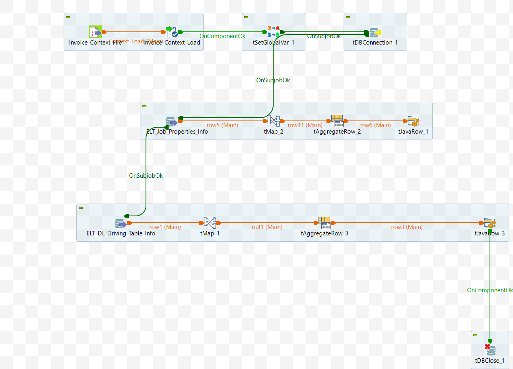

# Data Mart: Key Value Pairs for Settings_Position `'Join_Columns' (ELT_DL_ExecutesqlGroupbyFilter_Join)

## Intent
Generate field `Join_Dynamic_Groupby_Filter_Config` comprising modified `key=value` pairs that are associated with Settings_Position `'Join_Columns'`.

## DB Connection 

After reading the input parameters, the database connection is established using the provided details — such as URL, username, password, and properties. 

 - Auto commit should be enabled.
 - Additional Parameter - `noDatetimeStringSync=true`  [MySql]
 - The database connection must be properly closed at the end of the operation.

## Input Specifications
The component or service is dependent on the following input data:

- App DB Connection Details
- DL_ID
- Default
  - job_type is `DL`
  - Component is `executesqlfiltergroupby`
  - Settings_Position is `'Join_Columns'`

## Output Specifications

- The fields `Join_Dynamic_Groupby_Filter_Config` and `Previous_Component` are populated and utilized by other components. The `Previous_Component` has fixed string as "Join_Aggregation".

## Component 1: Generate a script with properties formatted as `key=value` pairs

- Retrieve records from `ELT_Job_Properties_Info` where the Component is `executesqlfiltergroupby` and  `Active_Flag` is 1.
- Format the data as `key=value`, appending each entry on a new line.
- Group the records by the `script` field.
- Select the last value from the group for the `script` field, using ORDER BY and LIMIT if necessary.
- `FilterGroupBy` is set with the `script` value. It is referred into next component.
- The `script` is a consolidated list of key-value pairs, each separeted by newline.

## Component 2: Set Join_Dynamic_Groupby_Filter_Config with modified `key=value` pairs script

- Retrieve the Records from  `ELT_DL_FilterGroupBy_Info` associated with given 'Job_Id' and 'DL_Id' and where Settings_Position is `'Join_Columns'`.
- However, the above data does not seem to be used.
- Format the data:`FilterGroupBy` value that came from previous component
  - replace "Dynamic_FilterGroupby_Name" with "Join_Aggregation"
  - replace "Dynamic_FilterGroupby_Source" with Var.Last_Component_Name
- The `Previous_Component` is set as `"Join_Aggregation"`.
- Aggregation is done as below but seem redundant.
  - Group by all the records based on the fields `Dynamic_Groupby_Filter_Config` and `Previous_Name`
  - Choose last value from the grouped rows for `Dynamic_Groupby_Filter_Config`, `Previous_Name`. Order_by alongwith LIMIT may be used.
- The fields `Join_Dynamic_Groupby_Filter_Config` and `Previous_Component` are populated for utilization in other copmpoents.

<details>
<summary>Additional Details</summary>

Component 1: Following fields are seleted associated with the Job_Type 'DL' and Component 'executesqlfiltergroupby'

```sql
SELECT 
  `ELT_Job_Properties_Info`.`Id`, 
  `ELT_Job_Properties_Info`.`Job_Type`, 
  `ELT_Job_Properties_Info`.`Component`, 
  `ELT_Job_Properties_Info`.`Key_Name`, 
  `ELT_Job_Properties_Info`.`Value_Name`, 
  `ELT_Job_Properties_Info`.`Active_Flag`, 
  `ELT_Job_Properties_Info`.`Dynamic_Flag`
FROM `ELT_Job_Properties_Info`
where Job_Type='DL' and Component ='executesqlfiltergroupby' and  Active_Flag=1
```

 - Format the data as `key=value`. Appending each entry on a new line.

| Name     | Expression                                                                                                           |
|----------|----------------------------------------------------------------------------------------------------------------------|
| condition| `(StringHandling.LEN(row5.Value_Name) > 0) ? "=" :  ""`   #length is > 0                                                            |
| Script   | `Var.Script == null ? row5.Key_Name + Var.condition + row5.Value_Name : Var.Script + "\n" + row5.Key_Name + Var.condition + row5.Value_Name` |


Component 2:

- Retrieve the data. Settings_Position='Join_Columns'
```sql
SELECT distinct 
  `ELT_DL_FilterGroupBy_Info`.`DL_Id`, 
  `ELT_DL_FilterGroupBy_Info`.`Job_Id`, 
  `ELT_DL_FilterGroupBy_Info`.Group_By_Id,
  `ELT_DL_FilterGroupBy_Info`.Filter_Id,
  `ELT_DL_FilterGroupBy_Info`.Flow,
  `ELT_DL_FilterGroupBy_Info`.`Settings_Position`
FROM `ELT_DL_FilterGroupBy_Info`
WHERE 
 Settings_Position='Join_Columns' and Job_Id='Job_Id' and DL_Id='DL_Id'
```
- Format the data as per table below. However it seems independent of above data.

| Name                        | Expression                                                                                                                                              |
|-----------------------------|----------------------------------------------------------------------------------------------------------------------------------------------------------|
| Filter_By                   | (String)globalMap.get("FilterGroupBy")                                                                                                                    |
| Last_Component_Name         | (String)(((java.util.concurrent.ConcurrentHashMap)context.sharedMap).get("Previous_Component"))                                                          |
| Dynamic_FilterGroupby_Name  | `Var.Filter_By.replace("Dynamic_FilterGroupby_Name", "Join_Aggregation"); `                                                                |
| Dynamic_FilterGroupby_Source|  Var.Dynamic_FilterGroupby_Name.replace("Dynamic_FilterGroupby_Source", Var.Last_Component_Name);                                          |
| Previous_Name               | "Join_Aggregation"                                                                                                                                    |
</details>

The schematic of the job is shown in the [attached diagram](#appendix-a).


## Appendix A

Schematic diagram of the component (Talend job).


