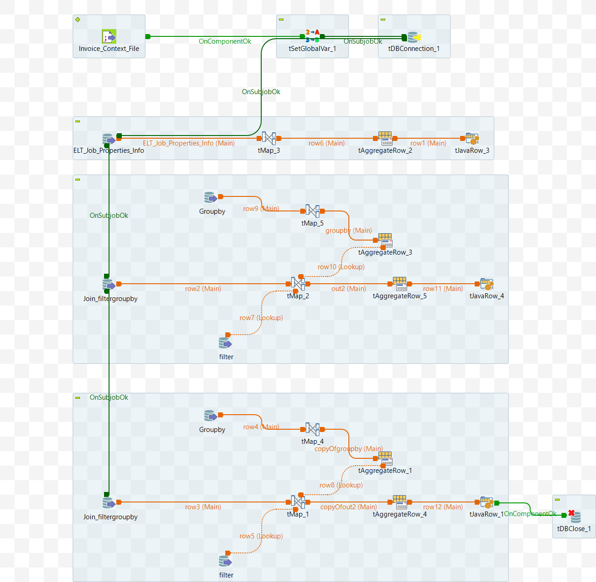

# Data Mart: GroupBy Filter Value scripts  (ELT_DL_ExecutesqlGroupbyFilter_Values)

## Intent

Generate scripts `JoinFilterGroupby` & `DerivedFilterGroupby` associated with Settings_Position `'Join_Columns'` & `'Derived_Columns'`, respectively.

## DB Connection 

After reading the input parameters, the database connection is established using the provided details — such as URL, username, password, and properties. 

 - Auto commit should be enabled.
 - Additional Parameter - `noDatetimeStringSync=true`  [MySql]
 - The database connection must be properly closed at the end of the operation.

## Input Specifications
The component or service is dependent on the following input data:

- App DB Connection Details
- DL_ID
- Default
  - job_type is `DL`
  - Component is `executesqlfiltergroupby`
  - Settings_Position is `'Join_Columns'` or `'Derived_Columns'`

## Output Specifications

- The `JoinFilterGroupby` parameter is set with an appropriate script associated with `Settings_position` is 'Join_Columns'.
- The `DerivedFilterGroupby` parameter is set with an appropriate script associated with  `Settings_position` is 'Derived_Columns'.

## Component 1: Generate a script with properties formatted as `key=value` pairs

- Retrieve records from `ELT_Job_Properties_Info` where the Component is `executesqlfiltergroupby` and  `Active_Flag` is 1, `Dynamic_Flag` is 1.
- Format the data as `Value_Name`, appending each entry (field `value`) on a new line.
- Group the records by the `Value_Name` field.
- Select the last value from the group for the `Value_Name` field, using ORDER BY and LIMIT if necessary.
- `FilterGroupBy` is set with the `Value_Name` value. It is referred into next component.
- The `Value_Name` is a consolidated list of distinct `value`, each separeted by newline.


<details>
<summary>Additional Details</summary>

### Component 1: Following fields are seleted associated with the Job_Type 'DL' and Component 'executesqlfiltergroupby'

```sql
  SELECT DISTINCT
   `ELT_Job_Properties_Info`.`Value_Name`
  FROM `ELT_Job_Properties_Info`
  where Job_Type='DL' and Component='executesqlfiltergroupby' and Active_Flag=1 and Dynamic_Flag=1
```

 - Format the data as `key=value`. Appending each entry on a new line.

| Name  | Expression  |
|-------|-------------|
| Value | Var.Value == null ? ELT_Job_Properties_Info.Value_Name : Var.Value + "\n" + ELT_Job_Properties_Info.Value_Name |
</details>


## Component 2: Constitute `JoinFilterGroupby` script

- Execute below three SQL queries to fetch the required data:
  - Fetch group by, and filter etc. from `ELT_DL_FilterGroupBy_Info` table for specified job and data load IDs, where the `Settings_position` is 'Join_Columns'.
    - Format data to get fields `allcolumn`, `groupbycolumns`. See additional details.
    - use groupby and aggregate. Get `allcolumn` as consolidated list. The `groupbycolumns` as the data in the last row.
  - Retrieve group by details and other things for specific job and data load IDs from joined `ELT_DL_FilterGroupBy_Info` and `ELT_DL_Group_By_Info` tables where the `Settings_position` is 'Join_Columns'
  - Retrieve filter conditions for specific job and data load IDs by joining `ELT_DL_FilterGroupBy_Info` and `ELT_DL_Filter_Info` tables where the `Settings_position` is 'Join_Columns'.
- Format the data from above sources to constitute Join_aggregation query. Output is `Join_FilterGroupby`. Refer Additional Details.
- Aggregation:
  - Group by all the records based on the fields `JoinFilterGroupby`
  - Choose last value from the grouped rows for `JoinFilterGroupby`. Order_by alongwith LIMIT may be used.
- The field `JoinFilterGroupby` is populated for utilization in other copmponents.

<details>
<summary>Additional Details</summary>

### Component 2:

The three SQL queries are executed:
- Fetch group by, and filter etc. from `ELT_DL_FilterGroupBy_Info` table for specified job and data load IDs, where the `Settings_position` is 'Join_Columns'.
- Retrieve group by details and other things for specific job and data load IDs from joined `ELT_DL_FilterGroupBy_Info` and `ELT_DL_Group_By_Info` tables where the `Settings_position` is 'Join_Columns'
- Retrieve filter conditions for specific job and data load IDs by joining `ELT_DL_FilterGroupBy_Info` and `ELT_DL_Filter_Info` tables where the `Settings_position` is 'Join_Columns'.

```sql
SELECT 
  `ELT_DL_FilterGroupBy_Info`.`Job_Id`, 
  `ELT_DL_FilterGroupBy_Info`.`DL_Id`, 
  `ELT_DL_FilterGroupBy_Info`.`Group_By_Id`, 
  `ELT_DL_FilterGroupBy_Info`.`Filter_Id`, 
  `ELT_DL_FilterGroupBy_Info`.`Flow`
FROM `ELT_DL_FilterGroupBy_Info`
where Settings_Position='Join_Columns' and Job_Id='Job_Id' and DL_Id='DL_Id'


Select a.DL_Id,
  a.Job_Id,
  a.Group_By_Id,
  b.Table_Name_Alias,
  b.Column_Name,
  b.Column_Name_Alias,
  b.Aggregation,
  b.Flag
from ELT_DL_FilterGroupBy_Info a 
inner join ELT_DL_Group_By_Info b
on a.Group_By_Id=b.Group_By_Id and a.Settings_Position='Join_Columns'  and Job_Id='Job_Id' and DL_Id='DL_Id'

Select a.DL_Id,
  a.Job_Id,
  a.Filter_Id,
  b.Filter_Condition 
from ELT_DL_FilterGroupBy_Info a inner join ELT_DL_Filter_Info b
on a.Filter_Id=b.Filter_Id and a.Settings_Position='Join_Columns' and Job_Id='Job_Id' and DL_Id='DL_Id'

```
- Format the data as per table below.

| Name            | Expression|
|-----------------|--------------------------------------------|
| FilterGroupby   | (String)globalMap.get("Filtergroupby")|
| where_condition | row2.Filter_Id != 0 && row2.Group_By_Id == 0 ? " where " + row7.Filter_Condition : row2.Filter_Id != 0 && row2.Group_By_Id > 0 && row2.Flow.equals("F") ? " where " + row7.Filter_Condition + " Group by " + row10.groupbycolumns : row2.Filter_Id != 0 && row2.Group_By_Id > 0 && row2.Flow.equals("G") ? " Group by " + row10.groupbycolumns + " having " + row7.Filter_Condition : row2.Filter_Id == 0 && row2.Group_By_Id > 0 ? " Group by " + row10.groupbycolumns : ""                                                                              |
| columns         | row2.Group_By_Id != 0 ? row10.allcolumn : " * "|
| statement       | "select " + Var.columns + " from Join_FilterGroupby " + Var.where_condition|
| alias_name      | Var.FilterGroupby.replace("\\$\\{Dynamic_FilterGroupby_Name.source.alias.names}", "Join_Aggregation.source.alias.names=Join_FilterGroupby")|
| query           | Var.alias_name.replace ("\\$\\{Dynamic_FilterGroupby_Name.query}", "Join_Aggregation.query=" + Var.statement)| |

- Data formatting for the group by 

| Name           |    Expression  |
|----------------|------------------------------|
| Aggregation    | row9.Aggregation.equals("Random") ? "First" : (row9.Aggregation.equals("GroupBy") ? "" : row9.Aggregation)        |
| allcolumn      | Var.Aggregation.equals("Distinct_Count") ? "count(distinct `" + row9.Column_Name_Alias + "`) as `" + row9.Column_Name_Alias + "`" : Var.Aggregation.equals("Stddev_Samp") ? "case when Stddev_Samp(`" + row9.Column_Name_Alias + "`)='NaN' then null else Stddev_Samp(`" + row9.Column_Name_Alias + "`) end as `" + row9.Column_Name_Alias + "`" : Var.Aggregation.equals("Var_Samp") ? "case when Var_Samp(`" + row9.Column_Name_Alias + "`)='NaN' then null else Var_Samp(`" + row9.Column_Name_Alias + "`) end as `" + row9.Column_Name_Alias + "`" : Var.Aggregation + "(`" + row9.Column_Name_Alias + "`) as `" + row9.Column_Name_Alias + "`" |
| groupbycolumns | Var.groupbycolumns == null ? (row9.Flag == 0 ? row9.Column_Name_Alias : null) : (row9.Flag == 0 ? row9.Column_Name_Alias + "," + Var.groupbycolumns : Var.groupbycolumns)
</details>

## Component 3: Constitute `Derived_FilterGroupby` script

- Execute below three SQL queries to fetch the required data:
  - Fetch group by, and filter etc. from `ELT_DL_FilterGroupBy_Info` table for specified job and data load IDs, where the `Settings_position` is 'Derived_Columns'.
    - Format data to get fields `allcolumn`, `groupbycolumns`. See additional details.
    - use groupby and aggregate. Get `allcolumn` as consolidated list. The `groupbycolumns` as the data in the last row.
  - Retrieve group by details and other things for specific job and data load IDs from joined `ELT_DL_FilterGroupBy_Info` and `ELT_DL_Group_By_Info` tables where the `Settings_position` is 'Derived_Columns'
  - Retrieve filter conditions for specific job and data load IDs by joining `ELT_DL_FilterGroupBy_Info` and `ELT_DL_Filter_Info` tables where the `Settings_position` is 'Derived_Columns'.
- Format the data from above sources to constitute Join_aggregation query. Output is `Derived_FilterGroupby`. Refer Additional Details.
- Aggregation:
  - Group by all the records based on the fields `Derived_FilterGroupby`
  - Choose last value from the grouped rows for `Derived_FilterGroupby`. Order_by alongwith LIMIT may be used.
- The field `DerivedFilterGroupby` is populated for utilization in other copmponents.


<details>
<summary>Additional Details</summary>

### Component 3:  `Settings_position`='Derived_Columns'

The three SQL queries are executed:
- Fetch group by, and filter etc. from `ELT_DL_FilterGroupBy_Info` table for specified job and data load IDs, where the `Settings_position` is 'Derived_Columns'.
- Retrieve group by details and other things for specific job and data load IDs from joined `ELT_DL_FilterGroupBy_Info` and `ELT_DL_Group_By_Info` tables where the `Settings_position` is 'Derived_Columns'
- Retrieve filter conditions for specific job and data load IDs by joining `ELT_DL_FilterGroupBy_Info` and `ELT_DL_Filter_Info` tables where the `Settings_position` is 'Derived_Columns'.

```sql
SELECT 
  `ELT_DL_FilterGroupBy_Info`.`Job_Id`, 
  `ELT_DL_FilterGroupBy_Info`.`DL_Id`, 
  `ELT_DL_FilterGroupBy_Info`.`Group_By_Id`, 
  `ELT_DL_FilterGroupBy_Info`.`Filter_Id`, 
  `ELT_DL_FilterGroupBy_Info`.`Flow`
FROM `ELT_DL_FilterGroupBy_Info` 
where Settings_Position='Derived_Columns' and Job_Id='Job_Id' and DL_Id='DL_Id'

Select a.DL_Id,
  a.Job_Id,
  a.Group_By_Id,
  b.Table_Name_Alias,
  b.Column_Name,
  b.Column_Name_Alias,
  b.Aggregation,
  b.Flag
from ELT_DL_FilterGroupBy_Info a 
inner join ELT_DL_Group_By_Info b
on a.Group_By_Id=b.Group_By_Id and a.Settings_Position='Derived_Columns'  and Job_Id='Job_Id' and DL_Id='DL_Id'

Select a.DL_Id,
  a.Job_Id,
  a.Filter_Id,
  b.Filter_Condition 
from ELT_DL_FilterGroupBy_Info a inner join ELT_DL_Filter_Info b
on a.Filter_Id=b.Filter_Id and a.Settings_Position='Derived_Columns' and Job_Id='Job_Id' and DL_Id='DL_Id'

```
- Format the data as per table below.

| Name            | Expression                                                                                                                                                                                                                                                                                                                                                                                                                                                                                                                                                                                                                   |
|-----------------|--------------------------------------------|
| FilterGroupby   | (String)globalMap.get("Filtergroupby")|
| where_condition | row2.Filter_Id != 0 && row2.Group_By_Id == 0 ? " where " + row7.Filter_Condition : row2.Filter_Id != 0 && row2.Group_By_Id > 0 && row2.Flow.equals("F") ? " where " + row7.Filter_Condition + " Group by " + row10.groupbycolumns : row2.Filter_Id != 0 && row2.Group_By_Id > 0 && row2.Flow.equals("G") ? " Group by " + row10.groupbycolumns + " having " + row7.Filter_Condition : row2.Filter_Id == 0 && row2.Group_By_Id > 0 ? " Group by " + row10.groupbycolumns : ""                                                                              |
| columns         | row2.Group_By_Id != 0 ? row10.allcolumn : " * "|
| statement       | "select " + Var.columns + " from Join_FilterGroupby " + Var.where_condition|
| alias_name      | Var.FilterGroupby.replace("\\$\\{Dynamic_FilterGroupby_Name.source.alias.names}", "Join_Aggregation.source.alias.names=Join_FilterGroupby")|
| query           | Var.alias_name.replace ("\\$\\{Dynamic_FilterGroupby_Name.query}", "Join_Aggregation.query=" + Var.statement)| |

- Data formatting for the group by 

| Name           | Expression                                                                                                                                                                                                                                                                                                                                                                                                                                                               |
|----------------|---------------------------------------------------------------------------------------------------------------------------------------------------------------------------------------------------------------------------------------------------------------------------------------------------------------------------------------------------------------------------------------------------------------------------------------------------------------------------|
| Aggregation    | row9.Aggregation.equals("Random") ? "First" : (row9.Aggregation.equals("GroupBy") ? "" : row9.Aggregation)                                                                                                                                                                                                                                                                                                                                                               |
| allcolumn      | Var.Aggregation.equals("Distinct_Count") ? "count(distinct `" + row9.Column_Name_Alias + "`) as `" + row9.Column_Name_Alias + "`" : Var.Aggregation.equals("Stddev_Samp") ? "case when Stddev_Samp(`" + row9.Column_Name_Alias + "`)='NaN' then null else Stddev_Samp(`" + row9.Column_Name_Alias + "`) end as `" + row9.Column_Name_Alias + "`" : Var.Aggregation.equals("Var_Samp") ? "case when Var_Samp(`" + row9.Column_Name_Alias + "`)='NaN' then null else Var_Samp(`" + row9.Column_Name_Alias + "`) end as `" + row9.Column_Name_Alias + "`" : Var.Aggregation + "(`" + row9.Column_Name_Alias + "`) as `" + row9.Column_Name_Alias + "`" |
| groupbycolumns | Var.groupbycolumns == null ? (row9.Flag == 0 ? row9.Column_Name_Alias : null) : (row9.Flag == 0 ? row9.Column_Name_Alias + "," + Var.groupbycolumns : Var.groupbycolumns)                                                                                                                                                                                                                                                                                                  |


</details>

The schematic of the job is shown in the [attached diagram](#appendix-a).


## Appendix A

Schematic diagram of the component (Talend job).


