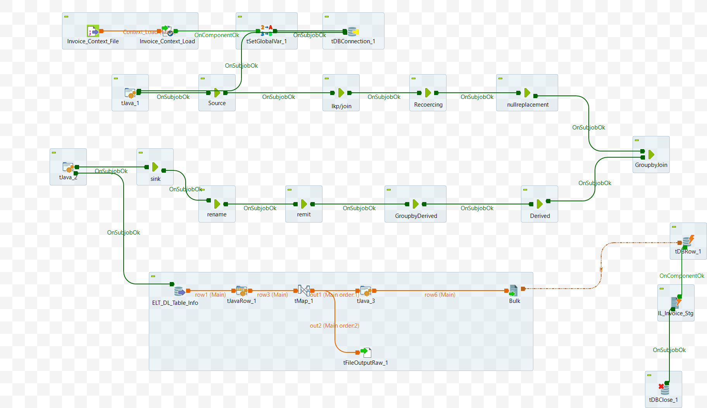

# Data Mart: DL Value File Parent (ELT_DL_Value_File_M8_v2_4)

The component comprises 10 jobs, executed in the sequence shown in the [attached diagram](#appendix-a).


1. Job 1 [Source](/DL_Config_File.md)
2. Job 2 [lkp/join](/ELT_DL_Value_File_M8.md)
3. Job 3 [Recoercing](/ELT_DL_Create_Script_M8.md)
4. Job 4 [NullReplacement](/DL%20Alter%20Jobs/ELT_DL_Alter_Job_Group.md)

1. Job 5 [GroupbyJoin](/DL_Config_File.md)
1. Job 6 [Derived](/DL_Config_File.md)
1. Job 7 [GroupbyDerived](/DL_Config_File.md)
3. Job 8 [remit](/ELT_DL_Create_Script_M8.md)
4. Job 9 [Rename](/DL%20Alter%20Jobs/ELT_DL_Alter_Job_Group.md)
5. Job 10 [Sink](/ELT_DL_Saved_Info_M8_v1.md)

## Final Task
After successfully completing the previous 10 sub-jobs:
- Select the updated table information from the above sub-jobs.
- Delete old records from `ELT_DL_VALUES_PROPERTIES` table associated with the `DL_Id` and `Job_Id`.
- Update the `ELT_DL_VALUES_PROPERTIES` table with the new details. (refer to Additional Details below)

<details>
<summary>Additional Details</summary>

1. Select the updated table information

    ```sql
    select 
        DL_Id,
        DL_Name,
        DL_Table_Name,
        DL_Version,
        DL_Active_Flag
    from ELT_DL_Table_Info where DL_Active_Flag='1' and DL_Id='DL_Id'
    ```
1. Purge the old references
    ```sql
    Delete from ELT_DL_VALUES_PROPERTIES where DL_Id = 'DL_Id' and Job_Id='Job_Id'
    ```

3. Details that have to be updated into the table `ELT_DL_VALUES_PROPERTIES` 

    | Name             | Expression             |
    |------------------|------------------------|
    | DL_Id            | row3.DL_Id             |
    | Job_Id           | context.Job_Id         |
    | DL_Name          | row3.DL_Name           |
    | DL_Table_Name    | row3.DL_Table_Name     |
    | value_file_name  | Var.config_file_name   |
    | Active_Flag      | row3.DL_Active_Flag    |


</details>

## Appendix A

Schematic diagram of the component.


