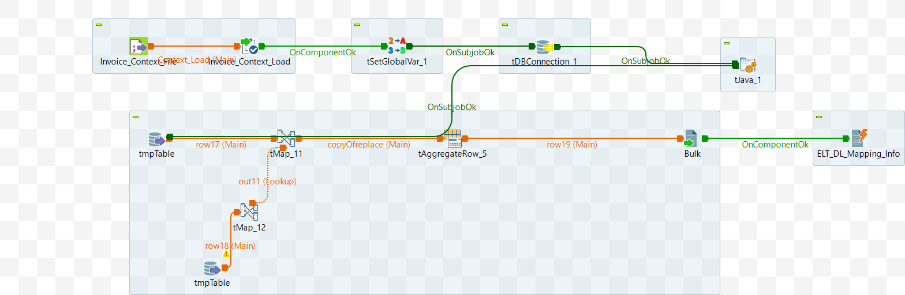

# Data Mart: Escaping Special Characters in Table Names (ELT_DL_Spcl_char_repl_Config_M8_v2)

## Intent
Purpose of this component is to copy all the records corresponding to the input `DL_ID` from the table `ELT_DL_Mapping_Info_Saved` to the table `ELT_DL_Mapping_Info`.

## DB Connection 

Once the Input parameters are read into the system, the database connection is established using the provided details — such as URL, username, password, and properties. 

 - Auto commit should be enabled.
 - The database connection must be properly closed at the end of the operation.

 ## Input Specifications
The component or service is dependent on the following input data:

- App DB Connection Details
- orig_table_name - Original Table Name
- DL_Id
- Job_Id
- DL_Name


## Component 1: Copy Records into `ELT_DL_Mapping_Info`

Temporary table name is formed with the below parameters: 
TempTableName = 'DL_Name' +  'DL_Id' +  'Job_Id';

```sql
INSERT INTO target_table (column1, column2, column3, ...)
SELECT column1, column2, column3, ...
FROM source_table
WHERE condition;
```

<details>
<summary>Additional Details</summary>

In the talend job, following fields are fetched and copied

```sql
TempTableName = 'DL_Name' +  'DL_Id' +  'Job_Id';
SELECT 
  "+ DL_Id +" as `DL_Id`,
  "+ Job_Id +" as `Job_Id`,
  TempTableName.`table_name`, 
  TempTableName.`property`
FROM TempTableName 
where property!='db' and table_name='orig_table_name'
```
```sql
SELECT distinct
  "+ DL_Id +" as `DL_Id`,
  "+ Job_Id +" as `Job_Id`, 
 case when `ELT_App_Names_Properties`.`CharacterValue`=' ' then ',' else CharacterValue end, 
  `ELT_App_Names_Properties`.`Id`
FROM `ELT_App_Names_Properties` where CharacterValue not in ('_','-','/','|')  limit 30
```
Before inserting the records, all existing relevant records are purged.

```sql
     "Delete from ELT_DL_Mapping_Info  where DL_Id='"+context.DL_Id+"'"
```

</details>

The schematic of the job is shown in the [attached diagram](#appendix-a).

## Appendix A

Schematic diagram of the component (Talend job).


