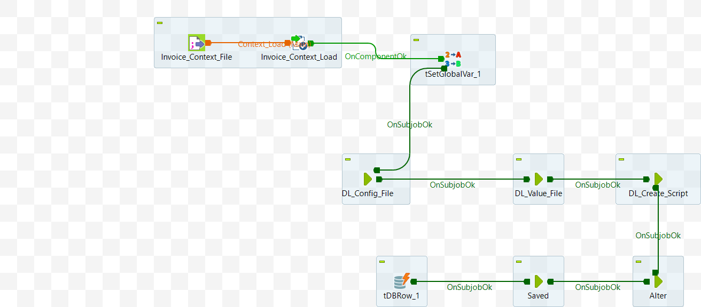

# Data Mart: Config Scripts Generate (ELT_DL_Parent_Generate_M8_v2_1_4)

The component consists of below 5 jobs. the sequence of these jobs is shown in the [attached diagram](#appendix-a).


1. Job 1 [DL_Config_File](/DL_Config_File.md)
2. Job 2 [DL_Value_File](/ELT_DL_Value_File_M8.md)
3. Job 3 [DL_Create_Script](/ELT_DL_Create_Script_M8.md)
4. Job 4 [DL_Alter](/DL%20Alter%20Jobs/ELT_DL_Alter_Job_Group.md)
5. Job 5 [DL_Saved](/ELT_DL_Saved_Info_M8_v1.md)


## Final Task
Once all the previous 5 sub jobs are successfully completed, delete the table if exists in APP DB Connection.

```sql
    "Drop table if exists `"+context.DL_Name+context.DL_Id+context.Job_Id+"`"
```

## Appendix A

Schematic diagram of the component.




## Appendix B

List of all Context Variables.


                                                      


