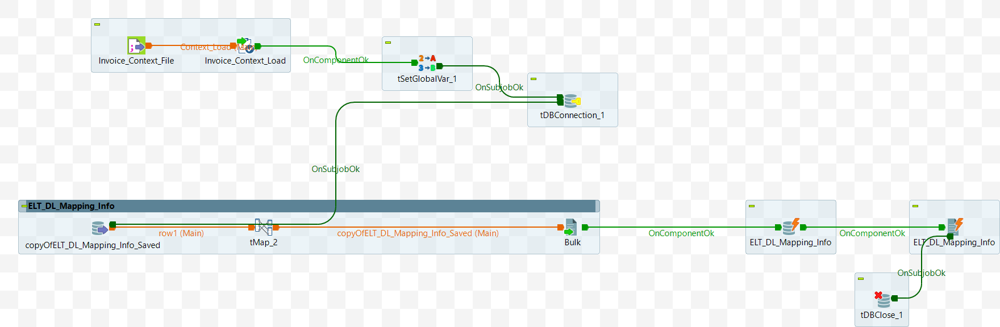

# Data Mart Create Script (ELT_DL_Saved_Info_M8_v1)

## Intent
Purpose of this component is to copy all the records corresponding to the input `DL_ID` from the table `ELT_DL_Mapping_Info_Saved` to the table `ELT_DL_Mapping_Info`.


## DB Connection 

Once the Input parameters are read into the system, the database connection is established using the provided details — such as URL, username, password, and properties. 

 - Auto commit should be enabled.
 - The database connection must be properly closed at the end of the operation.

### Fetch and Copy the Records
As there is no modification in data, the following methodology can be used to fetch and copy the relevant records, at once. See additional Details below for list of the fields.
```sql
INSERT INTO target_table (column1, column2, column3, ...)
SELECT column1, column2, column3, ...
FROM source_table
WHERE condition;
```

<details>
<summary>Additional Details</summary>

In the talend job, following fields are fetched and copied

```sql
"SELECT 
  `ELT_DL_Mapping_Info_Saved`.`DL_Id`, 
  `ELT_DL_Mapping_Info_Saved`.`DL_Name`, 
  `ELT_DL_Mapping_Info_Saved`.`DL_Column_Names`, 
  `ELT_DL_Mapping_Info_Saved`.`Constraints`, 
  `ELT_DL_Mapping_Info_Saved`.`DL_Data_Types`, 
  `ELT_DL_Mapping_Info_Saved`.`Column_Type`, 
  `ELT_DL_Mapping_Info_Saved`.`Added_Date`, 
  `ELT_DL_Mapping_Info_Saved`.`Added_User`, 
  `ELT_DL_Mapping_Info_Saved`.`Updated_Date`, 
  `ELT_DL_Mapping_Info_Saved`.`Updated_User`
FROM `ELT_DL_Mapping_Info_Saved`
where DL_Id='"+context.DL_Id+"'"
```
There is direct copies of all the fields fectched from the DB in the previous Step. 

Before inserting the records, all existing relevant records are purged.

```sql
     "Delete from ELT_DL_Mapping_Info  where DL_Id='"+context.DL_Id+"'"
```
The schematic of the job is shown in the [attached diagram](#appendix-a).

</details>

## Appendix A

Schematic diagram of the component (Talend job). Java service 




## Appendix B

List of all Context Variables.


                                                      


